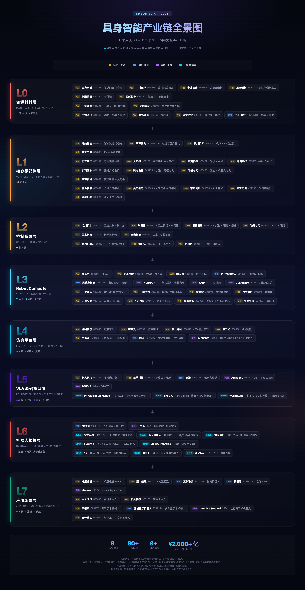

# 具身智能（Embodied AI）产业链全景图（2026 版）

> 面向投资研究与产业研究的产业链地图。覆盖从资源材料到应用场景的 8 个层次，包含全球龙头、中国龙头、A股/港股/美股上市公司、一级市场独角兽、关联受益公司、核心技术壁垒、市场空间与投资逻辑。

---

## 🗺 产业链全景图（一眼看完）



> 上图汇总 **80+ 上市标的** 与 **9 家一级独角兽**。A 股 / 港股 / 美股 / 独角兽 用不同色徽标区分。点击图下方章节导航进入每个层次的深度分析。

---

## 一、产业链全景

```
L0  资源材料层          机器人时代的"石油"
│   ├─ 稀土永磁          钕铁硼（NdFeB）
│   ├─ 特种钢材
│   ├─ 碳纤维
│   └─ 锂电池材料
│
▼
L1  核心零部件层        整个产业链利润率最高的硬件环节
│   ├─ 减速器            RV 减速器 / 谐波减速器
│   ├─ 丝杠              行星滚柱丝杠
│   ├─ 电机              无框力矩电机 / 伺服电机
│   ├─ 编码器
│   ├─ 传感器            六维力传感器
│   └─ 灵巧手
│
▼
L2  控制系统层
│   ├─ 运动控制器
│   ├─ 机器人控制器
│   ├─ ROS
│   └─ 实时操作系统（RTOS）
│
▼
L3  Robot Compute       机器人时代 GPU 层
│   ├─ GPU / 机器人 SoC
│   └─ 边缘 AI 芯片
│
▼
L4  仿真平台            机器人版 Unreal Engine
│   ├─ 数字孪生
│   ├─ Isaac Sim
│   ├─ Cosmos（世界模型训练）
│   └─ World Model
│
▼
L5  VLA 基础模型层      未来可能诞生千亿美元公司的赛道
│   ├─ OpenVLA（开源）
│   ├─ NVIDIA GR00T
│   ├─ Google Gemini Robotics
│   ├─ Skild AI  ── Skild Brain
│   └─ Physical Intelligence  ── π0 / π0.5
│
▼
L6  机器人整机层
│   ├─ 工业机器人
│   ├─ 协作机器人
│   └─ 人形机器人
│
▼
L7  应用场景层
    ├─ 制造业
    ├─ 物流仓储
    ├─ 商业服务
    ├─ 家庭服务
    └─ 医疗护理
```

---

## 二、上市公司概览（按层级）

> 一图看完 8 个层次的全部上市标的。详细论证见各分章节。L0-L2 为硬件层，L3-L5 为"AI + 软件"基础设施层，L6-L7 为应用层。

### L0 资源材料层 · 11 家 A 股 + 1 家港股

| 细分领域 | A股 | 港股 | 美股 |
|----------|-----|------|------|
| 稀土永磁 | **金力永磁** 300748 · **中科三环** 000970 · **宁波韵升** 600366 · 正海磁材 300224 | — | — |
| 特种钢材 | 抚顺特钢 600399 · 西部超导 688122 | — | — |
| 碳纤维 | **中复神鹰** 688295 · **光威复材** 300699 | — | — |
| 锂电池材料 | **宁德时代** 300750 · 赣锋锂业 002460 · 华友钴业 603799 | **比亚迪股份** 1211.HK | — |

> **核心受益**：钕铁硼磁材、电池材料。详细：[01-L0-resources](./docs/01-L0-resources.md)

### L1 核心零部件层 · 18 家 A 股

| 细分领域 | A股 | 港股 | 美股 |
|----------|-----|------|------|
| 减速器（谐波） | **绿的谐波** 688017 · 汉宇集团 300403 | — | — |
| 减速器（RV） | **双环传动** 002472 · 秦川机床 000837 · 中大力德 002896 | — | — |
| 丝杠 | **恒立液压** 601100 · **贝斯特** 300580 · **五洲新春** 603667 · 鼎智科技 873593 | — | — |
| 无框电机 / 伺服 | **步科股份** 688160 · **鸣志电器** 603728 · 伟创电气 688698 · 江苏雷利 300660 | — | — |
| 力传感器 / 编码器 | **柯力传感** 603662 · 昊志机电 300503 · 东华测试 300354 · 奥普光电 002338 | — | — |
| 灵巧手 | **兆威机电** 003021 | — | — |

> **核心受益**：谐波减速器、行星滚柱丝杠、无框电机、六维力传感器。详细：[02-L1-components](./docs/02-L1-components.md)

### L2 控制系统层 · 9 家 A 股

| 细分领域 | A股 | 港股 | 美股 |
|----------|-----|------|------|
| 通用工控 + 伺服 | **汇川技术** 300124 · **埃斯顿** 002747 · 雷赛智能 002979 · 信捷电气 603416 | — | — |
| 运动控制器 | 固高科技 301510 · 智微智能 003997 | — | — |
| 工业机器人 | 新时达 002527 · **新松机器人** 300024 · 拓斯达 300607 | — | — |

> **核心受益**：汇川（多卡位）、埃斯顿、新松。详细：[03-L2-control](./docs/03-L2-control.md)

### L3 Robot Compute · 11 家 A 股 + 2 家港股 + 3 家美股

| 细分领域 | A股 | 港股 | 美股 |
|----------|-----|------|------|
| AI 芯片 / 机器人 SoC | **寒武纪** 688256 · 兆易创新 603986 · 瑞芯微 603893 | **地平线机器人** 9660.HK · 黑芝麻智能 2533.HK | **NVIDIA** · **AMD** · **Qualcomm** |
| 服务器代工 | **工业富联** 601138 | — | — |
| 光模块 | **中际旭创** 300308 · 新易盛 300502 · 天孚通信 300394 | — | — |
| PCB / 覆铜板 | **沪电股份** 002463 · 胜宏科技 300476 · 鹏鼎控股 002938 · 生益科技 600183 | — | — |

> **核心受益**：NVIDIA 卖铲人（光模块、PCB、代工）。详细：[04-L3-compute](./docs/04-L3-compute.md)

### L4 仿真平台层 · 5 家 A 股 + 1 家港股 + 1 家美股

| 细分领域 | A股 | 港股 | 美股 |
|----------|-----|------|------|
| 数字孪生 / 仿真 | 能科科技 603859 · 霍莱沃 688701 | — | — |
| 3D 视觉 / 感知 | **奥比中光** 688322 · 凌云光 688400 | — | — |
| 数据平台 | 数据堂 829003 | — | — |
| 世界模型 / 多模态 | — | 商汤 0020.HK | **Alphabet**（DeepMind · Genie · Gemini Robotics） |

> **核心受益**：奥比中光（3D 感知）、数据堂（机器人数据）。详细：[05-L4-simulation](./docs/05-L4-simulation.md)

### L5 VLA 基础模型层 · 2 家 A 股 + 1 家港股 + 2 家美股 + 4 家独角兽

| 细分领域 | A股 | 港股 | 美股 |
|----------|-----|------|------|
| 多模态大模型 | **科大讯飞** 002230 · 云从科技 688327 | **商汤** 0020.HK | **Alphabet**（Gemini Robotics） |
| 视觉大模型 | 依图 / 旷视（已退市） | — | NVIDIA（GR00T） |
| **一级独角兽** | — | — | **Physical Intelligence**（约 150 亿美元+） · **Skild AI**（约 100 亿美元+） · **World Labs**（3 亿+ 融资） |

> **核心判断**：千亿美元公司候选赛道。详细：[06-L5-vla-model](./docs/06-L5-vla-model.md)

### L6 机器人整机层 · 1 家港股 + 1 家美股 + 多家独角兽

> 注：工业机器人整机公司已列在 L2 控制系统层（埃斯顿 002747、新时达 002527、新松 300024、拓斯达 300607）。

| 细分领域 | A股 | 港股 | 美股 |
|----------|-----|------|------|
| 工业机器人 | （见 L2） | — | — |
| 协作机器人 | — | 越疆科技（已申报） | — |
| 人形机器人 | — | **优必选** 9880.HK | **Tesla**（Optimus） |
| **一级独角兽** | 宇树科技 · 智元机器人 · 银河通用 · 傅利叶 · 星动纪元 | — | **Figure AI**（约 400 亿美元+） · Agility Robotics · 1X |

> **核心判断**：人形机器人量产时间表决定全产业链估值。详细：[07-L6-robot](./docs/07-L6-robot.md)

### L7 应用场景层 · 6 家 A 股 + 3 家港股 + 2 家美股

| 细分领域 | A股 | 港股 | 美股 |
|----------|-----|------|------|
| 物流仓储 | **海康威视** 002415 · 顺丰控股 002352 | **京东物流** 2618.HK · 极智嘉 02490.HK | **Amazon**（Kiva / Agility） |
| 商业服务 | 九号公司 689009 · 石头科技 688169 | — | — |
| 医疗护理 | **天智航** 688277 | **微创医疗机器人** 2252.HK | Intuitive Surgical |
| 制造业应用 | 三一重工 600031 · 富士康（A 股关联） | — | **Tesla** · BMW · Foxconn |

> **核心判断**：制造 + 物流最先落地，2025-2028；家庭服务要 2030+。详细：[08-L7-applications](./docs/08-L7-applications.md)

### 一图速览

> 数字代表上市公司数（A 股 / 港股 / 美股），不含一级独角兽。

| 层级 | 主题 | A股 | 港股 | 美股 | 核心标的口诀 |
|------|------|-----|------|------|--------------|
| L0 | 资源材料 | 11 | 1 | 0 | 磁材 + 电池 + 碳纤维 |
| L1 | 核心零部件 | 18 | 0 | 0 | 绿的谐波、恒立、步科、兆威 |
| L2 | 控制系统 | 9 | 0 | 0 | 汇川、埃斯顿、新松 |
| L3 | Robot Compute | 11 | 2 | 3 | NVIDIA + 卖铲人（光模块 PCB） |
| L4 | 仿真平台 | 5 | 1 | 1 | 奥比中光 + 数据堂 |
| L5 | VLA 模型 | 2 | 1 | 2 | 商汤 + 讯飞 + 独角兽 |
| L6 | 机器人整机 | 0 | 1 | 1 | 优必选、Tesla、宇树、智元（注：工业机器人见 L2） |
| L7 | 应用场景 | 6 | 3 | 2 | 海康、京东物流、极智嘉 |
| **合计** | — | **62** | **9** | **9** | — |

---

## 三、章节导航

| # | 章节 | 核心问题 | 链接 |
|---|------|----------|------|
| 0 | 产业链总览 | 8 层架构为什么这样切？每层解决什么？ | [00-overview](./docs/00-overview.md) |
| 1 | L0 资源材料层 | 谁掌握机器人时代的"石油"？ | [01-L0-resources](./docs/01-L0-resources.md) |
| 2 | L1 核心零部件层 | 硬件环节中谁赚走了最多利润？ | [02-L1-components](./docs/02-L1-components.md) |
| 3 | L2 控制系统层 | 机器人的"小脑"由谁提供？ | [03-L2-control](./docs/03-L2-control.md) |
| 4 | L3 Robot Compute | 谁是机器人时代的 NVIDIA？ | [04-L3-compute](./docs/04-L3-compute.md) |
| 5 | L4 仿真平台 | 机器人如何在虚拟世界被训练？ | [05-L4-simulation](./docs/05-L4-simulation.md) |
| 6 | L5 VLA 基础模型 | 谁能成为机器人时代的 OpenAI？ | [06-L5-vla-model](./docs/06-L5-vla-model.md) |
| 7 | L6 机器人整机 | 谁会造出机器人时代的"特斯拉"？ | [07-L6-robot](./docs/07-L6-robot.md) |
| 8 | L7 应用场景 | 机器人最先在哪些场景落地？ | [08-L7-applications](./docs/08-L7-applications.md) |
| 9 | A 股完整映射 | 每一层有哪些 A 股标的？ | [09-a-share-mapping](./docs/09-a-share-mapping.md) |
| 10 | 未来十年五大赛道 | 资本应该重仓哪些方向？ | [10-top-tracks](./docs/10-top-tracks.md) |
| 11 | 最终结论 | 万亿美元公司会诞生在哪一层？ | [11-final-conclusion](./docs/11-final-conclusion.md) |

---

## 三点五、公司深度报告（第三层）

> ⚠️ **重要声明**：每份公司报告顶部均含**投资风险免责声明**。财务数据为公开市场口径，**不构成任何投资建议**。

### L1 核心零部件层 · 18 家 A 股 ✅ 已完成

| Tier | 公司 | 代码 | 报告 |
|------|------|------|------|
| S | 绿的谐波 | 688017 | [L1-688017-绿的谐波.md](./docs/companies/L1-688017-绿的谐波.md) |
| S | 双环传动 | 002472 | [L1-002472-双环传动.md](./docs/companies/L1-002472-双环传动.md) |
| S | 恒立液压 | 601100 | [L1-601100-恒立液压.md](./docs/companies/L1-601100-恒立液压.md) |
| S | 步科股份 | 688160 | [L1-688160-步科股份.md](./docs/companies/L1-688160-步科股份.md) |
| S | 兆威机电 | 003021 | [L1-003021-兆威机电.md](./docs/companies/L1-003021-兆威机电.md) |
| S | 柯力传感 | 603662 | [L1-603662-柯力传感.md](./docs/companies/L1-603662-柯力传感.md) |
| A | 秦川机床 | 000837 | [L1-000837-秦川机床.md](./docs/companies/L1-000837-秦川机床.md) |
| A | 中大力德 | 002896 | [L1-002896-中大力德.md](./docs/companies/L1-002896-中大力德.md) |
| A | 贝斯特 | 300580 | [L1-300580-贝斯特.md](./docs/companies/L1-300580-贝斯特.md) |
| A | 五洲新春 | 603667 | [L1-603667-五洲新春.md](./docs/companies/L1-603667-五洲新春.md) |
| A | 鼎智科技 | 873593 | [L1-873593-鼎智科技.md](./docs/companies/L1-873593-鼎智科技.md) |
| A | 鸣志电器 | 603728 | [L1-603728-鸣志电器.md](./docs/companies/L1-603728-鸣志电器.md) |
| A | 伟创电气 | 688698 | [L1-688698-伟创电气.md](./docs/companies/L1-688698-伟创电气.md) |
| A | 江苏雷利 | 300660 | [L1-300660-江苏雷利.md](./docs/companies/L1-300660-江苏雷利.md) |
| B | 昊志机电 | 300503 | [L1-300503-昊志机电.md](./docs/companies/L1-300503-昊志机电.md) |
| B | 东华测试 | 300354 | [L1-300354-东华测试.md](./docs/companies/L1-300354-东华测试.md) |
| B | 奥普光电 | 002338 | [L1-002338-奥普光电.md](./docs/companies/L1-002338-奥普光电.md) |
| B | 汉宇集团 | 300403 | [L1-300403-汉宇集团.md](./docs/companies/L1-300403-汉宇集团.md) |

### L0 资源材料层 · 12 家上市公司 ✅ 已完成

| Tier | 公司 | 代码 | 报告 |
|------|------|------|------|
| S | 金力永磁 | 300748 | [L0-300748-金力永磁.md](./docs/companies/L0-300748-金力永磁.md) |
| S | 宁德时代 | 300750 | [L0-300750-宁德时代.md](./docs/companies/L0-300750-宁德时代.md) |
| S | 比亚迪股份 | 1211.HK | [L0-1211-比亚迪股份.md](./docs/companies/L0-1211-比亚迪股份.md) |
| A | 中科三环 | 000970 | [L0-000970-中科三环.md](./docs/companies/L0-000970-中科三环.md) |
| A | 宁波韵升 | 600366 | [L0-600366-宁波韵升.md](./docs/companies/L0-600366-宁波韵升.md) |
| A | 中复神鹰 | 688295 | [L0-688295-中复神鹰.md](./docs/companies/L0-688295-中复神鹰.md) |
| A | 光威复材 | 300699 | [L0-300699-光威复材.md](./docs/companies/L0-300699-光威复材.md) |
| A | 赣锋锂业 | 002460 | [L0-002460-赣锋锂业.md](./docs/companies/L0-002460-赣锋锂业.md) |
| A | 华友钴业 | 603799 | [L0-603799-华友钴业.md](./docs/companies/L0-603799-华友钴业.md) |
| B | 正海磁材 | 300224 | [L0-300224-正海磁材.md](./docs/companies/L0-300224-正海磁材.md) |
| B | 抚顺特钢 | 600399 | [L0-600399-抚顺特钢.md](./docs/companies/L0-600399-抚顺特钢.md) |
| B | 西部超导 | 688122 | [L0-688122-西部超导.md](./docs/companies/L0-688122-西部超导.md) |

### L2 控制系统层 · 9 家 A 股 ✅ 已完成

| Tier | 公司 | 代码 | 报告 |
|------|------|------|------|
| S | 汇川技术 | 300124 | [L2-300124-汇川技术.md](./docs/companies/L2-300124-汇川技术.md) |
| A | 埃斯顿 | 002747 | [L2-002747-埃斯顿.md](./docs/companies/L2-002747-埃斯顿.md) |
| A | 雷赛智能 | 002979 | [L2-002979-雷赛智能.md](./docs/companies/L2-002979-雷赛智能.md) |
| A | 新松机器人 | 300024 | [L2-300024-新松机器人.md](./docs/companies/L2-300024-新松机器人.md) |
| A | 固高科技 | 301510 | [L2-301510-固高科技.md](./docs/companies/L2-301510-固高科技.md) |
| B | 信捷电气 | 603416 | [L2-603416-信捷电气.md](./docs/companies/L2-603416-信捷电气.md) |
| B | 智微智能 | 003997 | [L2-003997-智微智能.md](./docs/companies/L2-003997-智微智能.md) |
| B | 新时达 | 002527 | [L2-002527-新时达.md](./docs/companies/L2-002527-新时达.md) |
| B | 拓斯达 | 300607 | [L2-300607-拓斯达.md](./docs/companies/L2-300607-拓斯达.md) |

### L3 Robot Compute · 16 家 A+港+美 ✅ 已完成

| Tier | 公司 | 代码 | 报告 |
|------|------|------|------|
| S | 寒武纪 | 688256 | [L3-688256-寒武纪.md](./docs/companies/L3-688256-寒武纪.md) |
| S | 中际旭创 | 300308 | [L3-300308-中际旭创.md](./docs/companies/L3-300308-中际旭创.md) |
| S | 工业富联 | 601138 | [L3-601138-工业富联.md](./docs/companies/L3-601138-工业富联.md) |
| S | NVIDIA | NVDA | [L3-NVDA-NVIDIA.md](./docs/companies/L3-NVDA-NVIDIA.md) |
| A | 沪电股份 | 002463 | [L3-002463-沪电股份.md](./docs/companies/L3-002463-沪电股份.md) |
| A | 兆易创新 | 603986 | [L3-603986-兆易创新.md](./docs/companies/L3-603986-兆易创新.md) |
| A | 瑞芯微 | 603893 | [L3-603893-瑞芯微.md](./docs/companies/L3-603893-瑞芯微.md) |
| A | 地平线机器人 | 9660.HK | [L3-9660-地平线机器人.md](./docs/companies/L3-9660-地平线机器人.md) |
| A | 新易盛 | 300502 | [L3-300502-新易盛.md](./docs/companies/L3-300502-新易盛.md) |
| A | 天孚通信 | 300394 | [L3-300394-天孚通信.md](./docs/companies/L3-300394-天孚通信.md) |
| A | 胜宏科技 | 300476 | [L3-300476-胜宏科技.md](./docs/companies/L3-300476-胜宏科技.md) |
| A | 鹏鼎控股 | 002938 | [L3-002938-鹏鼎控股.md](./docs/companies/L3-002938-鹏鼎控股.md) |
| A | AMD | AMD | [L3-AMD-AMD.md](./docs/companies/L3-AMD-AMD.md) |
| A | Qualcomm | QCOM | [L3-QCOM-Qualcomm.md](./docs/companies/L3-QCOM-Qualcomm.md) |
| B | 生益科技 | 600183 | [L3-600183-生益科技.md](./docs/companies/L3-600183-生益科技.md) |
| B | 黑芝麻智能 | 2533.HK | [L3-2533-黑芝麻智能.md](./docs/companies/L3-2533-黑芝麻智能.md) |

### L4 仿真平台 · 7 家 ✅ 已完成

| Tier | 公司 | 代码 | 报告 |
|------|------|------|------|
| S | 奥比中光 | 688322 | [L4-688322-奥比中光.md](./docs/companies/L4-688322-奥比中光.md) |
| S | 商汤 | 0020.HK | [L4-0020-商汤.md](./docs/companies/L4-0020-商汤.md) |
| A | 能科科技 | 603859 | [L4-603859-能科科技.md](./docs/companies/L4-603859-能科科技.md) |
| A | 数据堂 | 829003 | [L4-829003-数据堂.md](./docs/companies/L4-829003-数据堂.md) |
| B | 霍莱沃 | 688701 | [L4-688701-霍莱沃.md](./docs/companies/L4-688701-霍莱沃.md) |
| B | 凌云光 | 688400 | [L4-688400-凌云光.md](./docs/companies/L4-688400-凌云光.md) |
| S | Alphabet | GOOGL | [L4-GOOGL-Alphabet.md](./docs/companies/L4-GOOGL-Alphabet.md) |

### L5 VLA 模型 · 5 家 + 独角兽 ✅ 已完成

| Tier | 公司 | 代码 | 报告 |
|------|------|------|------|
| S | 科大讯飞 | 002230 | [L5-002230-科大讯飞.md](./docs/companies/L5-002230-科大讯飞.md) |
| ★ | Physical Intelligence | 一级独角兽 | [L5-PI-Physical_Intelligence.md](./docs/companies/L5-PI-Physical_Intelligence.md) |
| ★ | Skild AI | 一级独角兽 | [L5-Skild_AI.md](./docs/companies/L5-Skild_AI.md) |
| ★ | World Labs | 一级独角兽 | [L5-World_Labs.md](./docs/companies/L5-World_Labs.md) |
| B | 云从科技 | 688327 | [L5-688327-云从科技.md](./docs/companies/L5-688327-云从科技.md) |

### L6 机器人整机 · 1 港 + 1 美 + 独角兽 ✅ 已完成

| Tier | 公司 | 代码 | 报告 |
|------|------|------|------|
| S | 优必选 | 9880.HK | [L6-9880-优必选.md](./docs/companies/L6-9880-优必选.md) |
| S | Tesla | TSLA | [L6-TSLA-Tesla.md](./docs/companies/L6-TSLA-Tesla.md) |
| ★ | 宇树科技 | 一级独角兽 | [L6-宇树科技.md](./docs/companies/L6-宇树科技.md) |
| ★ | 智元机器人 | 一级独角兽 | [L6-智元机器人.md](./docs/companies/L6-智元机器人.md) |
| ★ | 银河通用 | 一级独角兽 | [L6-银河通用.md](./docs/companies/L6-银河通用.md) |
| ★ | Figure AI | 一级独角兽 | [L6-Figure_AI.md](./docs/companies/L6-Figure_AI.md) |
| ★ | Agility Robotics | 一级独角兽 | [L6-Agility_Robotics.md](./docs/companies/L6-Agility_Robotics.md) |
| ★ | 1X | 一级独角兽 | [L6-1X.md](./docs/companies/L6-1X.md) |
| ★ | 傅利叶 | 一级独角兽 | [L6-傅利叶.md](./docs/companies/L6-傅利叶.md) |
| ★ | 星动纪元 | 一级独角兽 | [L6-星动纪元.md](./docs/companies/L6-星动纪元.md) |

### L7 应用场景 · 11 家 ✅ 已完成

| Tier | 公司 | 代码 | 报告 |
|------|------|------|------|
| S | 海康威视 | 002415 | [L7-002415-海康威视.md](./docs/companies/L7-002415-海康威视.md) |
| S | 京东物流 | 2618.HK | [L7-2618-京东物流.md](./docs/companies/L7-2618-京东物流.md) |
| S | Amazon | AMZN | [L7-AMZN-Amazon.md](./docs/companies/L7-AMZN-Amazon.md) |
| S | Intuitive Surgical | ISRG | [L7-ISRG-Intuitive_Surgical.md](./docs/companies/L7-ISRG-Intuitive_Surgical.md) |
| A | 顺丰控股 | 002352 | [L7-002352-顺丰控股.md](./docs/companies/L7-002352-顺丰控股.md) |
| A | 极智嘉 | 02490.HK | [L7-02490-极智嘉.md](./docs/companies/L7-02490-极智嘉.md) |
| A | 九号公司 | 689009 | [L7-689009-九号公司.md](./docs/companies/L7-689009-九号公司.md) |
| A | 石头科技 | 688169 | [L7-688169-石头科技.md](./docs/companies/L7-688169-石头科技.md) |
| A | 微创医疗机器人 | 2252.HK | [L7-2252-微创医疗机器人.md](./docs/companies/L7-2252-微创医疗机器人.md) |
| B | 天智航 | 688277 | [L7-688277-天智航.md](./docs/companies/L7-688277-天智航.md) |
| B | 三一重工 | 600031 | [L7-600031-三一重工.md](./docs/companies/L7-600031-三一重工.md) |

---

## 四、关键投资逻辑（速读版）

> 详细论证见各章节及 [10-top-tracks](./docs/10-top-tracks.md)、[11-final-conclusion](./docs/11-final-conclusion.md)。

**S 级（最值得重仓）**

- 机器人 GPU / 算力平台 ── NVIDIA 主导
- 机器人基础模型（VLA）── PI、Skild AI、Google DeepMind
- 世界模型（World Model）── Cosmos、World Labs、Genie
- 机器人数据平台
- 机器人仿真平台

**A 级（重点跟踪）**

- 丝杠（行星滚柱丝杠）── 人形机器人最大弹性赛道
- 减速器（RV + 谐波）
- 力传感器（六维力）
- 灵巧手

**B 级（生态受益）**

- 人形机器人整机
- 行业解决方案

---

## 五、核心结论

机器人产业可能复刻以下格局：

| 时代 | 底层算力 / OS | 上层生态 |
|------|---------------|----------|
| PC 时代 | Intel | Microsoft |
| 移动互联网 | Apple | Android |
| AI 时代 | NVIDIA | OpenAI |
| **机器人时代** | **NVIDIA + World Model** | **VLA Foundation Model + Humanoid OEM** |

从资本回报率角度看：

| 产业链层级 | 类比 | 谁是赢家候选 |
|------------|------|--------------|
| VLA 模型层 | OpenAI | PI、Skild AI |
| Robot Compute 层 | NVIDIA | NVIDIA、Qualcomm、AMD |
| 世界模型层 | Unreal Engine + OpenAI | NVIDIA Cosmos、World Labs |
| 核心零部件层 | 苹果供应链 | A 股 Tier S 标的 |
| 机器人整机层 | 特斯拉 | Tesla、Figure、宇树、优必选 |

**核心判断**：真正有机会诞生万亿美元公司的，大概率不在"机器人外壳"上，而在 **"机器人算力平台 + 世界模型 + VLA 基础模型 + 数据引擎"** 这一超级基础设施层。

---

## 六、文档使用说明

- 本文档按"层"组织，每层内部按 **全球龙头 / 中国龙头 / A股上市公司 / 港股上市公司 / 美股上市公司 / 一级市场独角兽 / 关联受益公司 / 核心技术壁垒 / 市场空间 / 投资逻辑** 十个维度展开。
- 投资逻辑层层递进：**L0 → L1** 看成本与产能；**L2 → L4** 看软件生态壁垒；**L5** 看模型与数据飞轮；**L6** 看量产能力；**L7** 看落地速度。
- A 股投资者优先看 [09-a-share-mapping](./docs/09-a-share-mapping.md)；一级市场投资者优先看 [07-L6-robot](./docs/07-L6-robot.md) 与 [06-L5-vla-model](./docs/06-L5-vla-model.md)。
